# @algorithm-visualizer/app

This package contains the application component.

 
 
 

## **Application Flow**

 

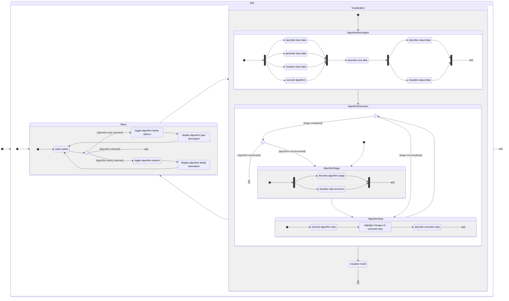

 
 
 

## **Wireframes**

 
 

### **Mobile**

 

#### **Landing Page**

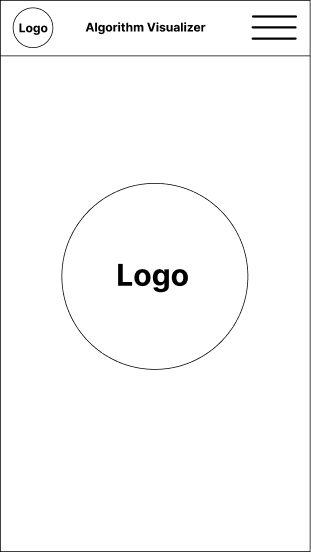

 

#### **Menu**

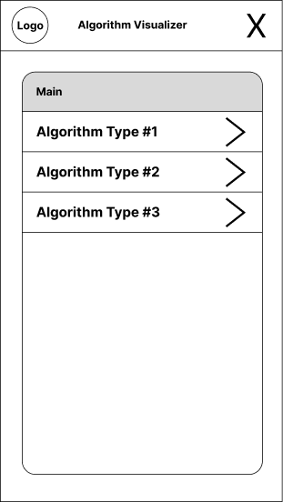
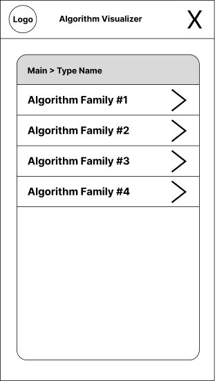
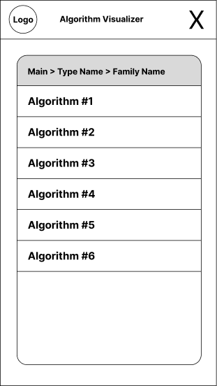

 

#### **Algorithm Description**

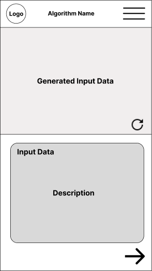
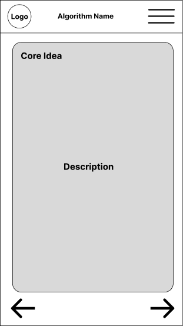
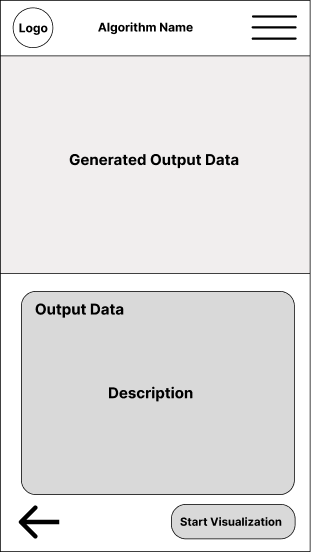

 

#### **Algorithm Execution**

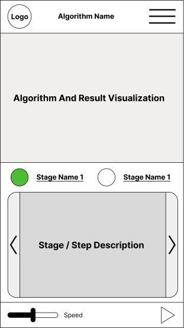

 

### **Desktop**

 

#### **Landing Page**

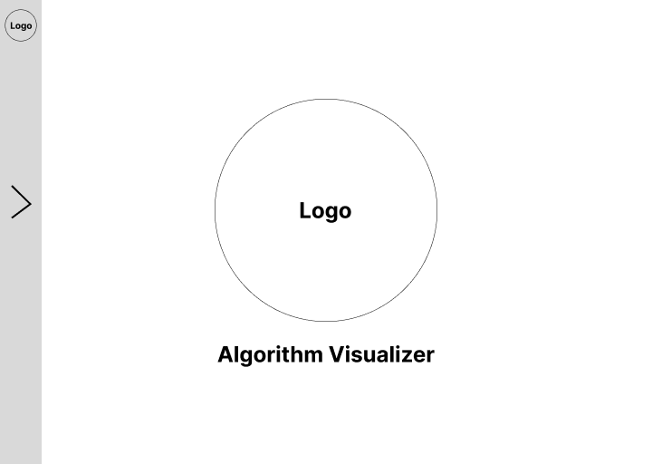

 

#### **Menu**

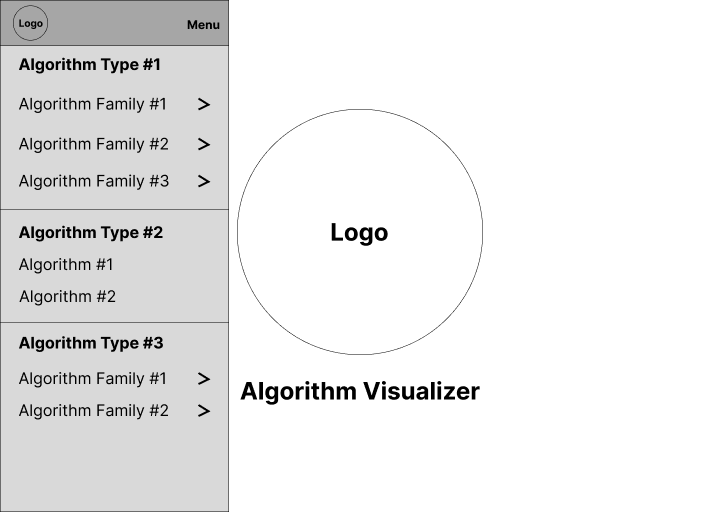
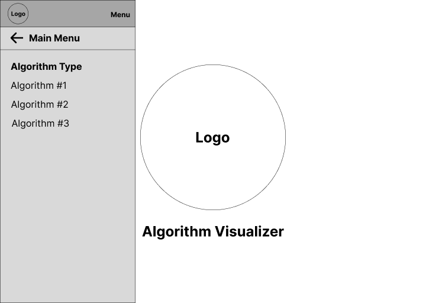

 

#### **Algorithm Description**

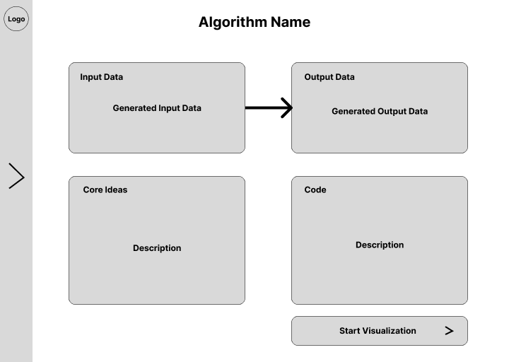

 

#### **Algorithm Execution**

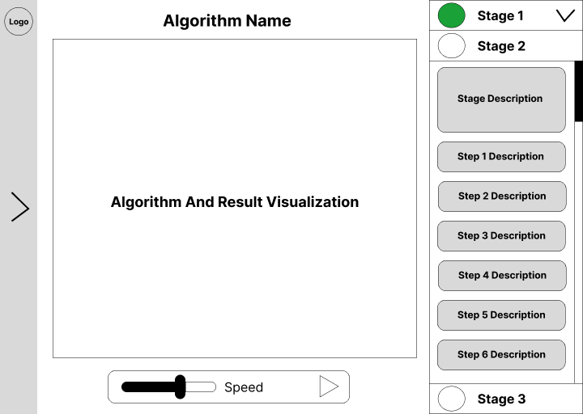
