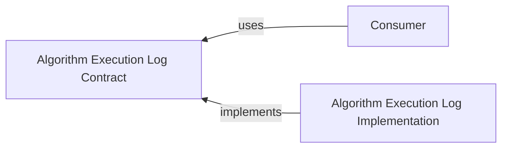

# @algorithm-visualizer/algorithm-execution-log-contract

This contract package contains interfaces and data transfer objects to decouple the consumer from the specific implementation of the `algorithm-execution-log` package.

