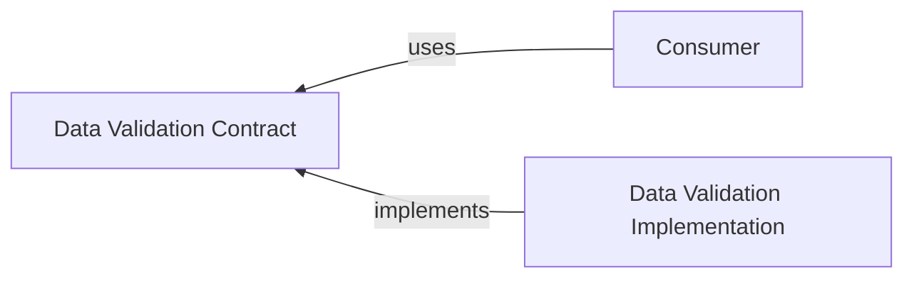

# @algorithm-visualizer/data-validation-contract

This contract package contains interfaces decouple the consumer from the specific implementation of the `data-validation` package.

 

## Interfaces

- [`IFunctionValidator`](./src/interfaces/function-validator.ts)
- [`IIntegerValidator`](./src/interfaces/integer-validator.ts)
- [`IListValidator`](./src/interfaces/list-validator.ts)
