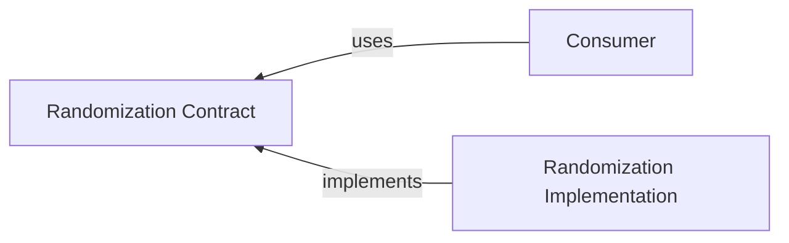

# @algorithm-visualizer/randomization-contract

This contract package contains interfaces to decouple the consumer from the specific implementation of the `randomization` package.

 

## Interfaces

- [`IRandomBooleanGenerator`](./src/interfaces/random-boolean-generator.ts)
- [`IRandomIntegerGenerator`](./src/interfaces/random-integer-generator.ts)
- [`IRandomListItemSelector`](./src/interfaces/random-list-item-selector.ts)
