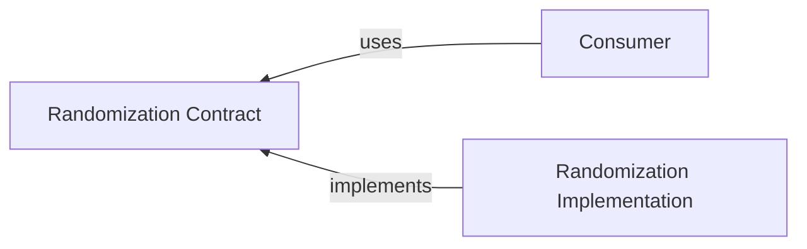

# @algorithm-visualizer/randomization-contract

This contract package contains interfaces to decouple the consumer from the specific implementation of the `randomization` package.

 

## Interfaces

- [`RandomBooleanGenerator`](./src/types/random-boolean-generator.ts)
- [`RandomIntegerGenerator`](./src/types/random-integer-generator.ts)
- [`RandomListItemSelector`](./src/types/random-list-item-selector.ts)
- [`RandomListShuffler`](./src/types/random-list-shuffler.ts)
