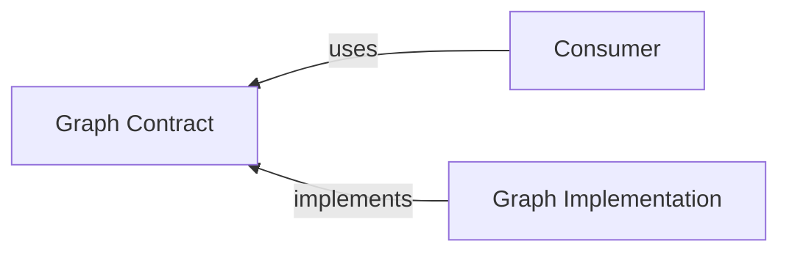

# @algorithm-visualizer/graph-contract

This contract package contains interfaces and data transfer objects to decouple the consumer from the specific implementation of the `graph` package.

 
 

## Generator

 

### Data Transfer Objects

- [`GraphGeneratorConfig`](./src/generator/data-transfer-objects/graph-generator-config.ts)
- [`GraphGeneratorError`](./src/generator/data-transfer-objects/graph-generator-error.ts)

 

### Interfaces

- [`IGraphGenerator`](./src/generator/interfaces/graph-generator.ts)

 

### Types

- [`DirectionOption`](./src/generator/types/graph-direction.ts)
- [`GraphGeneratorBuilder`](./src/generator/types/graph-generator-builder.ts)

 
 

## Structure

 

### Events

- [`EdgeAddedEvent`](./src/structure/events/edge-added-event.ts)
- [`EdgeBaseEvent`](./src/structure/events/edge-base-event.ts)
- [`EdgeDeletedEvent`](./src/structure/events/edge-deleted-event.ts)
- [`EdgeWeightChangedEvent`](./src/structure/events/edge-weight-changed-event.ts)
- [`GraphCreatedEvent`](./src/structure/events/graph-created-event.ts)
- [`NodeAddedEvent`](./src/structure/events/node-added-event.ts)
- [`NodeDeletedEvent`](./src/structure/events/node-deleted-event.ts)

 

### Interfaces

- [`IEdgeList`](./src/structure/interfaces/edge-list.ts)
- [`IEdge`](./src/structure/interfaces/edge.ts)
- [`IGraph`](./src/structure/interfaces/graph.ts)
- [`INodeList`](./src/structure/interfaces/node-list.ts)

 

### Types

- [`GraphBuilder`](./src/structure/types/graph-builder.ts)
- [`GraphStructureEvent`](./src/structure/types/graph-structure-event.ts)

 
 

## View

 

### Data Transfer Objects

 

#### Errors

- [`GraphVisualizationError`](./src/view/data-transfer-objects/errors/graph-visualization-error.ts)

 

#### Events

- [`EdgeBaseEvent`](./src/view/data-transfer-objects/events/edge-base-event.ts)
- [`EdgeDisplayedEvent`](./src/view/data-transfer-objects/events/edge-displayed-event.ts)
- [`EdgeHiddenEvent`](./src/view/data-transfer-objects/events/edge-hidden-event.ts)
- [`EdgeHighlightAddedEvent`](./src/view/data-transfer-objects/events/edge-highlight-added-event.ts)
- [`EdgeHighlightRemovedEvent`](./src/view/data-transfer-objects/events/edge-highlight-removed-event.ts)
- [`EdgeLabelChangedEvent`](./src/view/data-transfer-objects/events/edge-label-changed-event.ts)
- [`EdgeLabelDisplayedEvent`](./src/view/data-transfer-objects/events/edge-label-displayed-event.ts)
- [`EdgeLabelHiddenEvent`](./src/view/data-transfer-objects/events/edge-label-hidden-event.ts)
- [`EdgeLabelHighlightAddedEvent`](./src/view/data-transfer-objects/events/edge-label-highlight-added-event.ts)
- [`EdgeLabelHighlightRemovedEvent`](./src/view/data-transfer-objects/events/edge-label-highlight-removed-event.ts)
- [`GraphRenderedEvent`](./src/view/data-transfer-objects/events/graph-rendered-event.ts)
- [`NodeBaseEvent`](./src/view/data-transfer-objects/events/node-base-event.ts)
- [`NodeDisplayedEvent`](./src/view/data-transfer-objects/events/node-displayed-event.ts)
- [`NodeHiddenEvent`](./src/view/data-transfer-objects/events/node-hidden-event.ts)
- [`NodeHighlightAddedEvent`](./src/view/data-transfer-objects/events/node-highlight-added-event.ts)
- [`NodeHighlightRemovedEvent`](./src/view/data-transfer-objects/events/node-highlight-removed-event.ts)
- [`NodeLabelChangedEvent`](./src/view/data-transfer-objects/events/node-label-changed-event.ts)
- [`NodeLabelDisplayedEvent`](./src/view/data-transfer-objects/events/node-label-displayed-event.ts)
- [`NodeLabelHiddenEvent`](./src/view/data-transfer-objects/events/node-label-hidden-event.ts)
- [`NodeLabelHighlightAddedEvent`](./src/view/data-transfer-objects/events/node-label-highlight-added-event.ts)
- [`NodeLabelHighlightRemovedEvent`](./src/view/data-transfer-objects/events/node-label-highlight-removed-event.ts)
- [`NodeTitleChangedEvent`](./src/view/data-transfer-objects/events/node-title-changed-event.ts)

 

### Interfaces

- [`IGraphComponentSelector`](./src/view/interfaces/graph-component-selector.ts)
- [`INode`](./src/view/interfaces/graph-node.ts)
- [`IGraphSVGRenderEngine`](./src/view/interfaces/graph-svg-render-engine.ts)
- [`IGraphVisualizer`](./src/view/interfaces/graph-visualizer.ts)

 

### Types

- [`GraphRenderDirection`](./src/view/types/graph-render-direction.ts)
- [`GraphViewEvent`](./src/view/types/graph-view-event.ts)
- [`GraphVisualizationBuilder`](./src/view/types/graph-visualizer-builder.ts)
- [`EdgeLabelHighlightStyleClass`](./src/view/types/highlight-styles.ts)
- [`NodeHighlightStyleClass`](./src/view/types/highlight-styles.ts)
- [`NodeLabelHighlightStyleClass`](./src/view/types/highlight-styles.ts)
