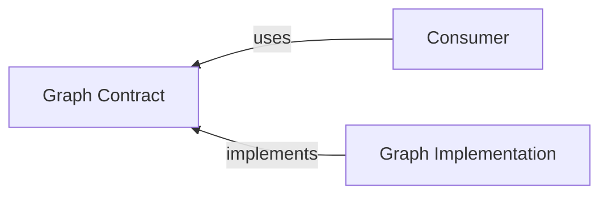

# @algorithm-visualizer/graph-contract

This contract package contains interfaces and data transfer objects to decouple the consumer from the specific implementation of the `graph` package.

 

## Interfaces

- [`IEdge`](./src/interfaces/edge.ts)
- [`IEdgeList`](./src/interfaces/edge-list.ts)
- [`IGraph`](./src/interfaces/graph.ts)
- [`IGraphBuilder`](./src/interfaces/builder-functions.ts)
- [`IGraphGenerator`](./src/interfaces/graph-generator.ts)
- [`IGraphGeneratorBuilder`](./src/interfaces/builder-functions.ts)
- [`GraphRenderDirection`](./src/interfaces/graph-render-direction.ts)
- [`IGraphSVGRenderEngine`](./src/interfaces/graph-svg-render-engine.ts)
- [`IGraphVisualizer`](./src/interfaces/graph-visualizer.ts)
- [`IGraphVisualizationBuilder`](./src/interfaces/builder-functions.ts)
- [`INode`](./src/interfaces/node.ts)
- [`INodeList`](./src/interfaces/node-list.ts)

 

## Data Transfer Objects

 

### Errors

- [`GraphGeneratorError`](./src/errors/graph-generator-error.ts)
- [`GraphVisualizationError`](./src/errors/graph-visualization-error.ts)

 

### Events

- [`EdgeAddedEvent`](./src/events/edge-added-event.ts)
- [`EdgeDeletedEvent`](./src/events/edge-deleted-event.ts)
- [`EdgeWeightChangedEvent`](./src/events/edge-weight-changed-event.ts)
- [`GraphCreatedEvent`](./src/events/graph-created-event.ts)
- [`NodeAddedEvent`](./src/events/node-added-event.ts)
- [`NodeDeletedEvent`](./src/events/node-deleted-event.ts)
- [`NodeHighlightedEvent`](./src/events/node-highlighted-event.ts)
- [`NodeLabelChangedEvent`](./src/events/node-label-changed-event.ts)

 

### Other

- [`GraphGeneratorConfig`](./src/other/graph-generator-config.ts)
