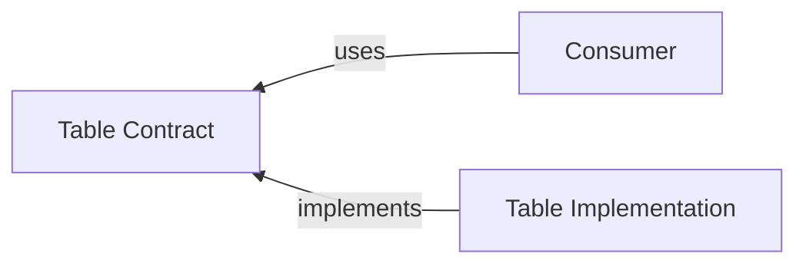

# @algorithm-visualizer/table-contract

This contract package contains interfaces and data transfer objects to decouple the consumer from the specific implementation of the `table` package.

```mermaid
flowchart RL
  A[Consumer]
  B[Table Contract]
  C[Table Implementation]
  A -- uses --> B
  C -- implements --> B
```
