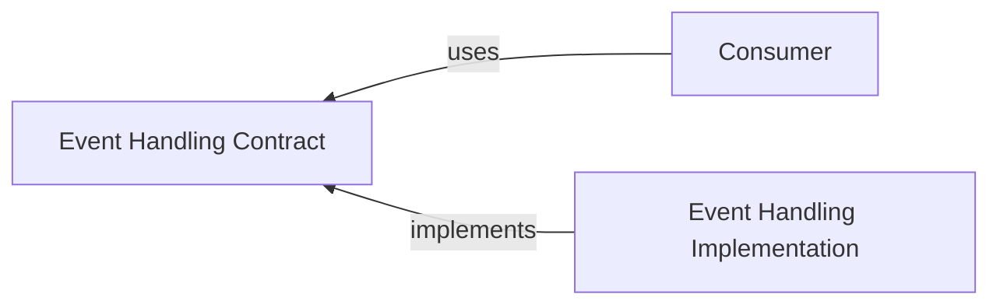

# @algorithm-visualizer/event-handling-contract

This contract package contains interfaces and data transfer objects to decouple the consumer from the specific implementation of the `event-handling` package.

 

## Interfaces

- [`IEventEmitter`](./src/interfaces/event-emitter.ts)
- [`IEventSubscriber`](./src/interfaces/event-subscriber.ts)
- [`IEventHandler`](./src/interfaces/event-handler.ts)
- [`IEventHandlerChain`](./src/interfaces/event-handler-chain.ts)

 

## Data Transfer Objects

- [`BaseEvent`](./src/other/base-event.ts)
