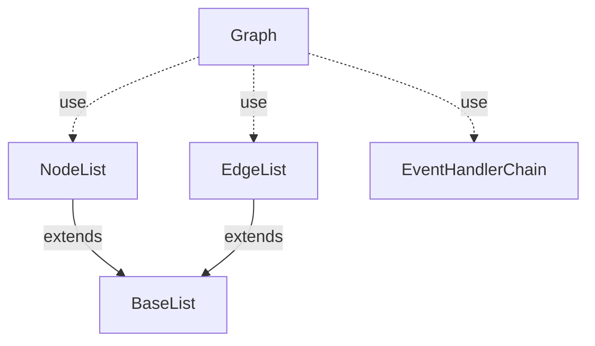
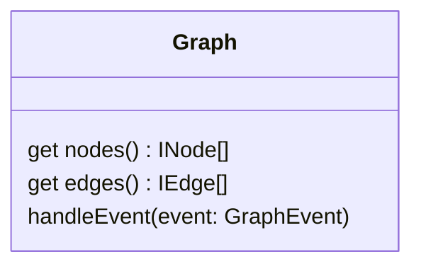

# @algorithm-visualizer/data-structures/graph

This package contains the graph data structure and related functionalities.

 
 

## Structure <!-- omit in toc -->

This directory contains all classes used to implement the graph data structure itself.
The `Graph` instance is a composite object and can be modified by [graph events](#events).

 

**Base Class Diagram**

 

**Graph Class**

 
 

## Events <!-- omit in toc -->

This directory contains all events that can be dispatched to a `Graph` instance in order to modify it:

- [`EdgeAddedEvent`](./src/events/edge-added-event.ts)
- [`EdgeDeletedEvent`](./src/events/edge-deleted-event.ts)
- [`EdgeWeightChangedEvent`](./src/events/edge-weight-changed-event.ts)
- [`NodeAddedEvent`](./src/events/node-added-event.ts)
- [`NodeDeletedEvent`](./src/events/node-deleted-event.ts)
- [`NodeLabelChangedEvent`](./src/events/node-label-changed-event.ts)
