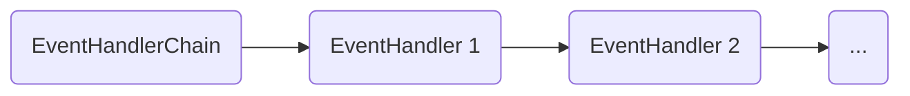
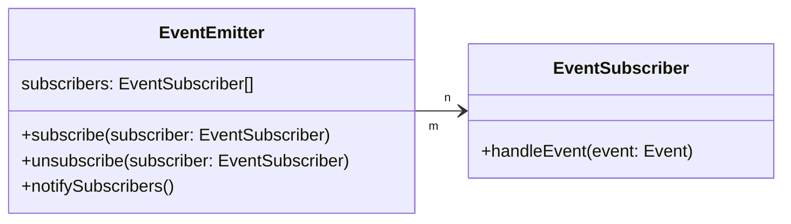

# @algorithm-visualizer/event-handling <!-- omit in toc -->

This utility package contains the following components to handle application events:

- [`BaseEvent`](./src/base-event.ts)
- [`EventHandler`](./src/event-handler.d.ts)
- [`EventHandlerChain`](./src/event-handler-chain.ts)
- [`EventSubscriber`](./src/event-subscriber.d.ts)

 
 

## `BaseEvent` <!-- omit in toc -->

Base class for events emitted by other packages.

 
 

## `EventHandler` <!-- omit in toc -->

Interface specifying an event handler.

 
 

## `EventHandlerChain` <!-- omit in toc -->

Passes an event through a chain of event handlers.

It can be configured to abort after the first successful handler that is responsible for the passed event.

 

 
 

## `EventSubscriber` <!-- omit in toc -->

Interfaces to implement the event subscription mechanism ([observer pattern](https://en.wikipedia.org/wiki/Observer_pattern)) that allows subscriber components to get notified about events emitted by another component.

 

