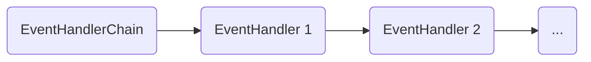
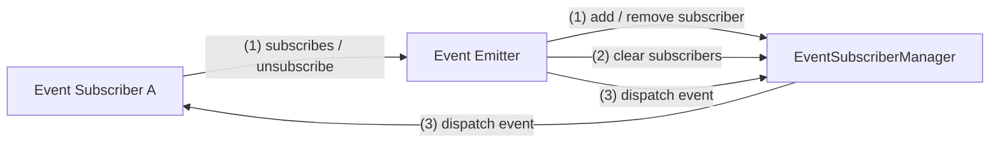

# @algorithm-visualizer/event-handling <!-- omit in toc -->

This utility package contains the following components to handle application events:

- [`EventHandlerChain`](#eventhandlerchain)
- [`EventSubscriberManager`](#eventsubscribermanager)

 
 

## `EventHandlerChain` <!-- omit in toc -->

Passes an event through a chain of event handlers.

It can be configured to abort after the first successful handler that is responsible for the passed event.

 

 
 

## `EventSubscriberManager` <!-- omit in toc -->

Encapsulates the managing of subscribers like adding, removing, clearing.

Event emitters can use this component to manage their subscribers and notify them about events.

 

