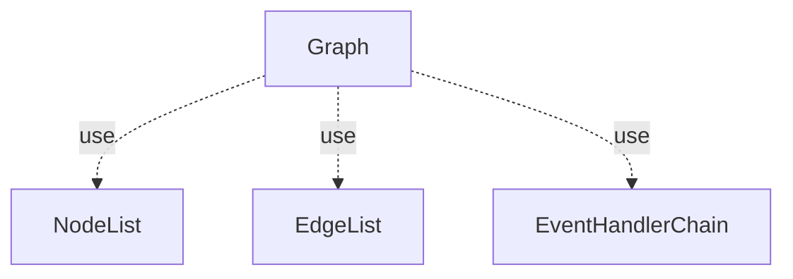
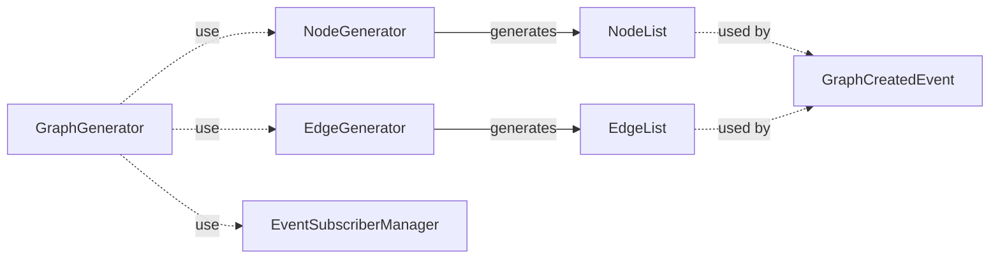
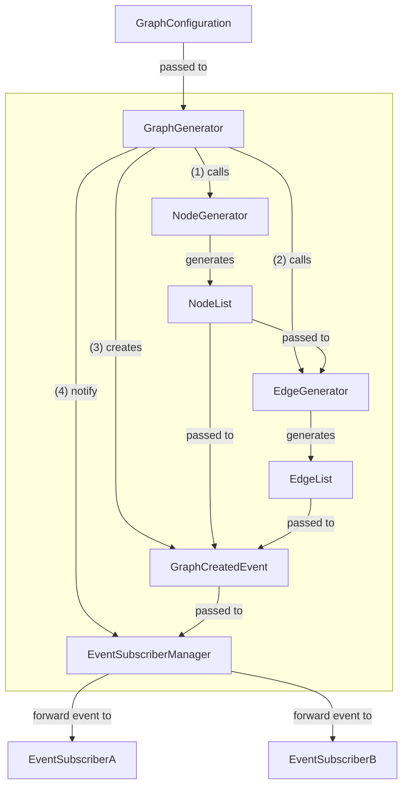
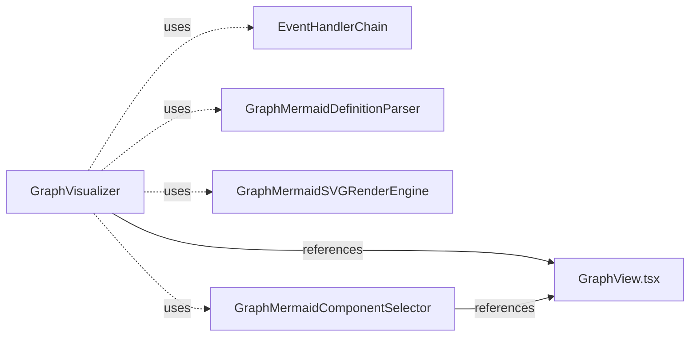
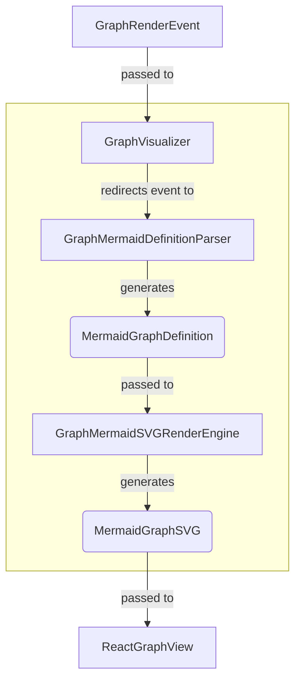
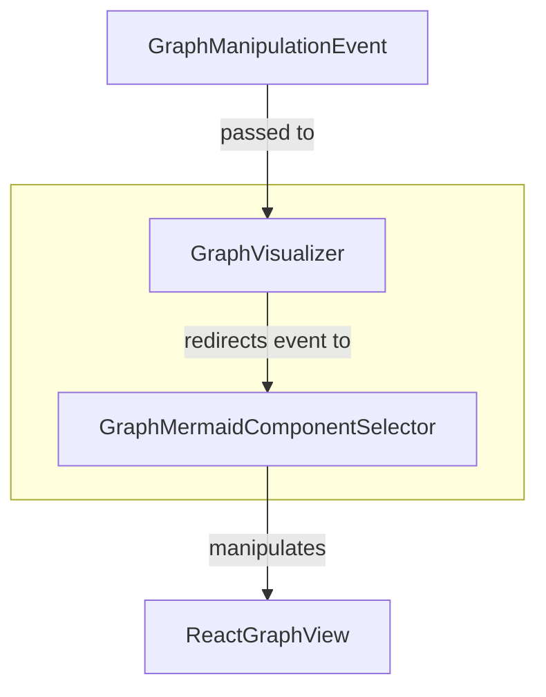

# @algorithm-visualizer/graph

This package contains the graph data structure and related functionalities.

 
 
 

## Structure

This directory contains all classes used to implement the graph data structure itself.
The `Graph` instance is a composite object and can be modified by [graph events](../../../contracts/data-structures/graph/README.md#events).

 
 

 
 
 

## Generator

This directory contains the implementation of the random graph generator.

It creates a random graph based on a passed [`GraphGeneratorConfig`](../../../contracts/data-structures/graph/src/other/graph-generator-config.ts) and dispatches a [`GraphCreatedEvent`](../../../contracts//data-structures/graph/src/events/graph-created-event.ts) to all its subscribers.

 
 

**Class Overview**

 
 

**Graph Generation Overview**

 
 
 

## View

This directory contains all classes used to visualize a given graph.

It visualizes the graph based on a passed [`GraphRenderedEvent`](../../../contracts/data-structures/graph/src/view/data-transfer-objects/events/graph-rendered-event.ts) and can be modified by a set of defined [`GraphViewEvents`](../../../contracts/data-structures/graph/README.md#events-1).

 
 

**Class Overview**

 
 

**Graph Render Process Overview**

 
 

**Graph Manipulation Process Overview**

