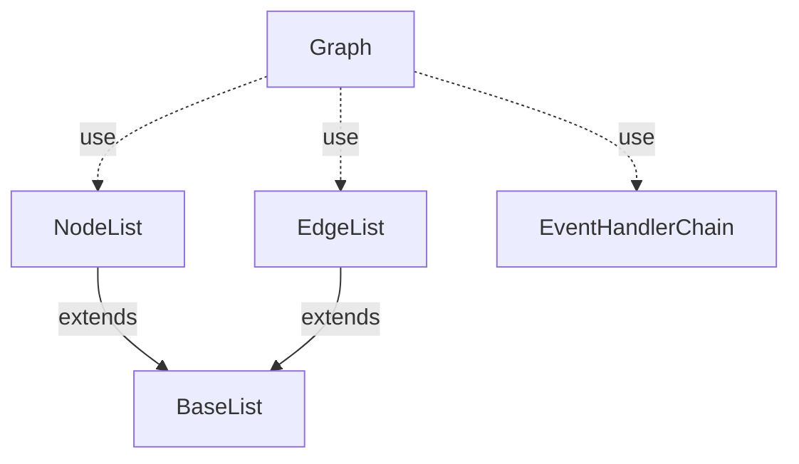
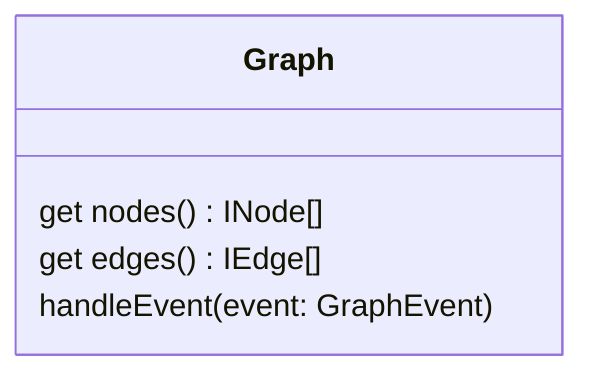
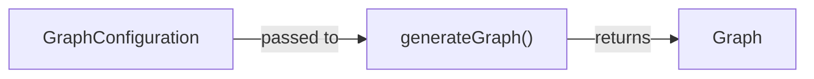

# @algorithm-visualizer/graph

This package contains the graph data structure and related functionalities.

 
 

## Structure <!-- omit in toc -->

This directory contains all classes used to implement the graph data structure itself.
The `Graph` instance is a composite object and can be modified by [graph events](#events).

 

**Base Class Diagram**

 

**Graph Class**

 
 

## Generator <!-- omit in toc -->

This directory contains the implementation of a random graph generator.

